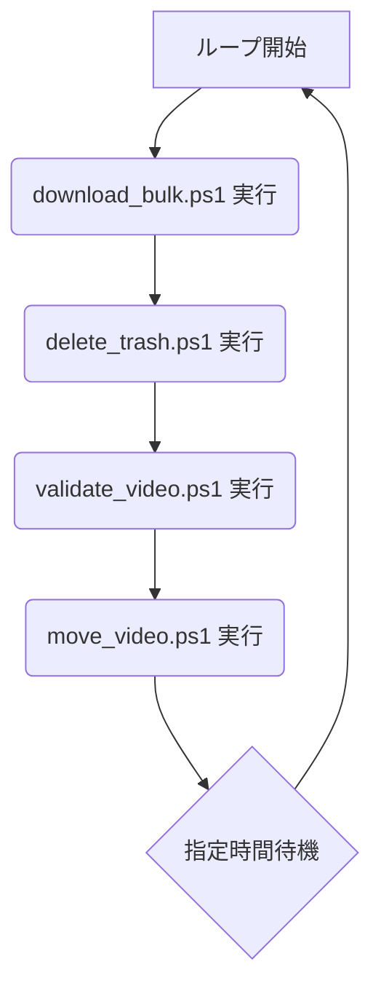

# 設計文書

## 概要

TVerRecは、PowerShell Coreを基盤としたクロスプラットフォームのTVerダウンロードツールです。Windows、Linux、macOSで動作し、OS固有のラッパースクリプト（CMD/Shell）を通じてコアロジックを呼び出す設計となっています。設定ファイルに基づき、キーワード検索や個別URL指定による番組の自動ダウンロードを実現します。

## アーキテクチャ

### 技術スタック
- **コアロジック**: PowerShell Core (pwsh)
- **動画ダウンロード**: yt-dlp (youtube-dlからフォーク)
- **動画変換・埋め込み**: FFmpeg
- **Windows GUI**: Windows Presentation Foundation (WPF), XAML
- **Unix/Linuxシェル**: Bash/Sh
- **Windowsシェル**: Command Prompt (CMD)
- **テスト**: Pester (PowerShell用テストフレームワーク)

### アプリケーション構造

    TVerRec/
    ├── win/                    # Windows用CMDラッパー
    ├── unix/                   # Linux/macOS用Shellラッパー
    ├── src/                    # コアロジック (PowerShellスクリプト)
    │   ├── functions/          # 共通関数
    │   ├── gui/                # GUI関連ロジック
    │   └── *.ps1               # 各機能のメインスクリプト
    ├── conf/                   # 設定ファイル
    │   ├── system_setting.ps1  # システムデフォルト設定
    │   └── user_setting.ps1    # (任意)ユーザー設定
    │   └── keyword.conf        # ダウンロードキーワード
    ├── db/                     # データファイル
    │   ├── history.csv         # ダウンロード履歴
    │   └── list.csv            # 生成されたダウンロード対象リスト
    ├── bin/                    # 依存実行ファイル (yt-dlp, ffmpeg)格納先
    ├── log/                    # ログファイル
    └── test/                   # Pesterによるテストスクリプト

## コンポーネントとインターフェース

### 主要コンポーネント（スクリプト）

#### 1. ラッパースクリプト (`win/*.cmd`, `unix/*.sh`)
- OS固有の処理（PowerShell Coreの存在確認・インストール支援、文字コード設定など）を担当。
- ユーザーが直接実行するエントリーポイント。
- 対応する `src` ディレクトリ内の `.ps1` スクリプトを `pwsh` コマンドで呼び出す。
- 例: `win/start_tverrec.cmd` は `src/loop.ps1` を起動する。

#### 2. コアロジックスクリプト (`src/*.ps1`)
- `loop.ps1`: 常駐監視のメインループ。定期的にリスト生成とダウンロードを実行。
- `generate_list.ps1`: `keyword.conf` を元にTVerを検索し、ダウンロード対象リスト (`list.csv`) を作成。
- `download_list.ps1`: `list.csv` に基づき、yt-dlpを並列実行して動画をダウンロード。
- `download_bulk.ps1`: `generate_list` と `download_list` を連続して実行する一括処理。
- `gui_main.ps1`: Windows GUIのメインウィンドウを起動・制御。XAMLファイルを読み込み、イベントを処理。

#### 3. 共通関数 (`src/functions/*.ps1`)
- `initialize.ps1`: 各スクリプトの初期化処理。設定読み込み、依存ツールのパス確認など。
- `common_functions.ps1`: ログ出力、ファイル操作など、複数のスクリプトで使われる共通機能。
- `tver_functions.ps1`: TVerサイトへのアクセスやAPI（非公式）からの情報取得など、TVerに特化した関数。

### インターフェース定義 (設定ファイル)

```powershell
# system_setting.ps1 / user_setting.ps1 の設定項目例
$TVerRec = @{
    Download             = @{
        Parallel           = 5       # 並列ダウンロード数
        Quality            = "best"  # ダウンロード品質
    }
    Path                 = @{
        FFmpeg             = "ffmpeg.exe"
        Ytdl               = "yt-dlp.exe"
    }
    Output               = @{
        Video              = "..\videos" # 保存先ディレクトリ
        Format             = "{title} - {series_title} [{service} {id}].{ext}" # ファイル名フォーマット
    }
}
```

## データモデル

### 設定データ
- **`system_setting.ps1`**: アプリケーションのデフォルト設定をPowerShellのハッシュテーブル形式で定義。
- **`user_setting.ps1`**: (任意) ユーザーがデフォルト設定を上書きするためのファイル。
- **`keyword.conf`**: 1行1キーワードでダウンロード対象を定義するテキストファイル。
- **`ignore.conf`**: ダウンロード対象外の番組IDやキーワードを定義するテキストファイル。

### 永続データ
- **`history.csv`**: ダウンロード済みの番組IDとダウンロード日時を記録するCSVファイル。重複ダウンロードの防止に使用。
- **`list.csv`**: `generate_list.ps1` によって生成されるダウンロード対象の番組情報（URL、タイトルなど）を格納するCSVファイル。

## エラーハンドリング

### ログ出力
- 全てのスクリプト実行において、標準出力とエラーはコンソールに表示される。
- `yt-dlp` や `ffmpeg` の実行でエラーが発生した場合、詳細なエラーログが `log/` ディレクトリに `ytdl_err_*.log`, `ffmpeg_err_*.log` として一時的に保存される。

### 依存関係エラー
- `.cmd` ラッパーは `pwsh` の存在をチェックし、なければインストールを案内する。
- `initialize.ps1` は `yt-dlp` と `ffmpeg` の実行ファイルが見つからない場合、エラーメッセージを表示して処理を中断する。自動ダウンロード機能も持つ。

## テスト戦略

### 単体テスト（Pester）
- `test/functions/*.Test.ps1` にて、`src/functions` 内のPowerShell関数のテストを実装。
- 設定ファイルの読み込み、APIからのデータ整形ロジックなどがテスト対象。
- `test_all.ps1` を実行することで、全てのテストケースを一度に実行可能。

### コンポーネントテスト
- 各機能のメインスクリプト (`download_bulk.ps1` など) を個別に実行し、期待通りに動作するかを手動で確認。

### E2Eテスト考慮事項
- `start_tverrec.cmd` を実行し、指定したキーワードの番組が定期的にダウンロードされ、`videos` ディレクトリに保存されるまでの一連の流れを確認する。
- GUI版 (`TVerRec.cmd`) を起動し、ボタン操作でダウンロードや設定変更が正しく反映されるかを確認する。

## プロセスフロー

### 1. 常駐監視プロセス (`loop.ps1`)

`start_tverrec.cmd` または `start_tverrec.sh` によって起動されるメインループです。以下の処理を無限に繰り返します。



| ステップ | スクリプト | 説明 |
|:---|:---|:---|
| 1 | `download_bulk.ps1` | キーワードに基づき、新しい番組の検索とダウンロードを行います。 |
| 2 | `delete_trash.ps1` | ダウンロード対象外リストに基づき、不要なファイルを削除します。 |
| 3 | `validate_video.ps1` | ダウンロード済みの動画ファイルが破損していないか検証します。 |
| 4 | `move_video.ps1` | 検証済みのファイルを最終的な保存場所に移動します。 |
| 5 | 待機 | `system_setting.ps1` で設定された `loopCycle` の秒数だけ待機します。 |

### 2. 一括ダウンロードプロセス (`download_bulk.ps1`)

TVerRecのコアとなる、キーワードに基づく一括ダウンロード処理です。リスト生成とダウンロードを一体となって行います。

```mermaid
flowchart TD
    subgraph "ステップ1: リンク収集"
        A[処理開始] --> B{キーワードリスト読込};
        B --> C{キーワード毎にループ};
        C --> D[TVerで番組を検索];
        D --> E{ダウンロード履歴と照合};
        E --> F[新規ダウンロード対象をリストに追加];
        F --> G{全キーワード処理完了?};
        G -- No --> C;
        G -- Yes --> H;
    end

    subgraph "ステップ2: ダウンロード実行"
        H[ユニークな番組リスト作成] --> I{ダウンロード対象毎にループ};
        I --> J[ディスク空き容量チェック];
        J --> K{並列ダウンロード数チェック};
        K --> L[yt-dlpでダウンロード実行 (バックグラウンド)];
        L --> M{全対象処理完了?};
        M -- No --> I;
        M -- Yes --> N;
    end

    subgraph "ステップ3: 後処理"
        N[全ダウンロードジョブの完了を待機] --> O[リネーム失敗などの中間ファイルを削除];
        O --> P[処理完了];
    end
```
